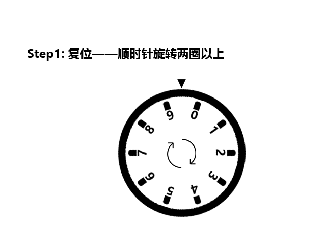
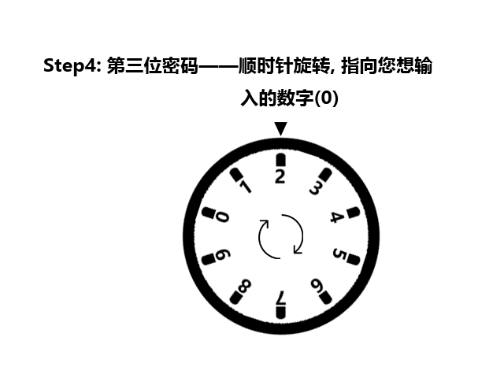

# Gift
首先~ 恭喜找到这里，应该还不算太难吧！

这里呢，是Easy Mode给予的提示，主要介绍一下该怎么输入密码哈哈~

密码一共有**三位**，而且**三位密码数字各不相同**，不过更多的提示还要靠大星自己接着去找了，嘿嘿

这里，我**假设**密码是**520**，来给大星演示一下该怎么输入~

## Step1 —— 复位
顺时针旋转两圈以上，就可以复位啦~

这个主要是保证输入密码是可靠的不会偏移，也就是说，在输入密码的任意一步，你都可以通过这个操作来清空密码输入，重新开始~

## Step2 —— 第一位密码

瞬时针两圈以后，顺势停在第一位密码处就好了（这里示范的是**5**20）。

> 如果发现转过了，比如在图里不小心转到了4的位置，一定要注意，那需要再顺时针转动，转到5的位置，不能逆时针转。

## Step3 —— 第二位密码

第二位密码的输入分为两个小步骤（这里示范的是5**2**0）：

- 先逆时针转动一整周；
- 再继续逆时针转动到第二位密码处停下；

> 需要注意的是，如果在这一步转错了，需要回到复位步骤重新开始。

## Step4 —— 第三位密码

瞬时针转动，在第三位密码处停下，此时右边的把手就可以较大幅度的转动了，顺时针扭动把手，拉开门就好~

> 如果在这里转错了，同样需要回到复位步骤重新开始。

